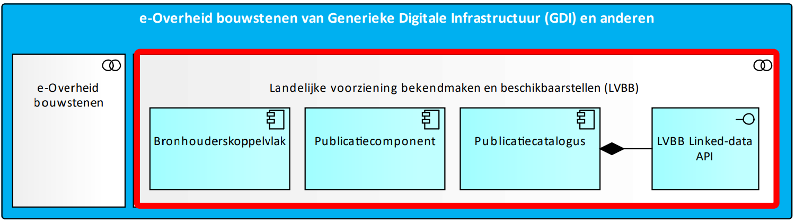

# Overzicht

**Dit hoofdstuk beschrijft kenmerken van deze Dataspecificatie.**

## Naam en Acroniemen

CIM-OP: Conceptueel Informatiemodel Officiële Publicaties binnen de context van het DSO.

## Informele beschrijving

### Definitie

Een aantal begrippen omvat de definitie van het domein van het Conceptuel Informatiemodel Officiële Publicaties - DSO (CIM-OP).

**STOP**: Standaard Officiële Publicaties

**Officiële Publicatie**: De bekendmaking in een Officieel publicatieblad. (Bron STOP).

**Publicatieblad**: Een van de bekendmakingsbladen waarin de officiële publicaties bekend gemaakt worden. (Bron STOP).

**DSO**: Digitaal Stelsel Omgevingswet

**LVBB**: De landelijke voorziening voor het bekendmaken en beschikbaar stellen van besluiten (officiele publicaties)

**DSO-LV**: De landelijke voorziening voor het digitaal ondersteunen van de Omgevingswet

CIM-OP bekijkt de informatiekundige inhoud van dit domein in zoverre dat dit in STOP is uitgewerkt en een rol speelt binnen het functioneren van het DSO.

### Beschrijving

CIM-OP beschrijft de integratie van de informatie, data, van de Landelijke voorziening Bekendmaking Besluiten (LVBB) en de landelijke voorziening DSO-LV.

Voor het beeld van die integratie of beter koppeling is het goed om een beeld van beide voorzieningen te hebben. We maken daarbij gebruik van beschrijvingen zoals ze zijn opgenomen in het DSO architectuur document DSO-LV/LVBB diensteneninformatiestromen per applicatiecluster.

**LVBB**

De landelijke voorzieningen voor het bekendmaken en beschikbaarstellen van officiele publicaties. De LVBB ontvangt alle besluiten van het bevoegd gezag, maakt daar officiële bekendmakingen van en stelt de nieuwe toestanden van geconsolideerde regelingen samen. De toestanden die hier ontstaan moeten planmatig worden doorgeleverd aan DSO-LV en op verzoek ook worden terug geleverd aan het bevoegd gezag.

<figure id="Figuur_1">

<figcaption>Context applicatiecluster Landelijke voorziening bekendmaken en beschikbaarstellen (LVBB) (bron: OGAS)</figcaption>
</figure>

**OZON**

Ozon wordt via het bronhouderskoppelvlak voor juridische regels (LVBB) geïnformeerd over nieuweregelingversies en zorgt voor de benodigde inwinning en validatie van OW-informatie, objectvormingenregistratie. De objecten die ontstaan worden binnen de landelijke objectstructuur ingepast en uitgeleverdviaAPI’s die zijn afgestemd op verschillende doelgroepen.

<figure id="Figuur_2">

<figcaption>Context applicatiecluster Objectgerichte Ontsluiting Omgevingsdocumenten (Ozon) (bron: OGAS)</figcaption>
</figure>

In onderstaand figuur wordt een overzicht gegeven van de infromatie-uitwisseling tussen verschillende componenten inclusief de LVBB en de DSO-LV met OZON.

<figure id="Figuur_3">

<figcaption>Overzicht informatie-uitwisseling tussen LVBB en DSO-LV (bron: OGAS)</figcaption>
</figure>

Binnen de context van de LVBB beschrijft de STOP standaard het informatiekundigperspectief en binnen OZON is IMOW de leidende informatiestandaard. Maar voor een effectieve ontsluiting van het dataproduct omgevingsdocument is een gedeeltelijke combinatie van beide en een afhankelijkheid van beide nodig. Het CIM-OP beschrijft die combinatie en afhankelijkheid vanuit het perspectief van de DSO-LV. Deze wordt in dit document de view van DSO-LV op STOP genoemd.

Onderstaand figuur geeft op hoofdlijn de relatie tussen kern-objecttypen uit CIM-OP en CIMOW.

<figure id="Figuur_4">

<figcaption>Relatie tussen kern-objecttypen uit CIM-OP en CIM-OW</figcaption>
</figure>

#### Use-cases voor CIM-OP

Het CIM-OP heeft als algemene use case (gebruikstoepassing) om informatiekundige relaties te leggen tussen functionaliteiten in de DSO-LV en de gegevens binnen STOP. Om dit concreter te maken is hier beneden een lijst opgenomen met specifieke use cases of vragen die door CIM-OP beantwoord moeten worden.

- Ideeënontwikkeling voor de samenhang en afstemming tussen STOP en IMOW.
- Ideeënontwikkeling voor de IMOW gerichte functionaliteit in OZON inclusief bevragings- en presentatiefunctionaliteit gerelateerd aan STOP.

Voorbeeld van een aantal specifieke situaties waar de CIM-OP informatietechnisch kan ondersteunen:
- Als een gebruiker vanuit de viewer op de tekst van een artikel klikt is het zinvol om uiteindelijk uit kunnen komen bij de wetstechnische informatie in het LVBB. Hiervoor moet er uit het IMOW een koppeling kunnen worden gelegd naar de juiste objecten in het CIM-OP 
- Als het bevoegd gezag twee besluiten neemt op basis van dezelfde regelingversie is er sprake van samenloop. In dat geval moet het bevoegd gezag los een consolidatie aanleveren. Hoe dit moet, en welke OW-objecten horen daar bij.
- Het intrekken van een regeling (via een besluit) moet leiden tot het niet meer hebben van gerelateerde IMOW objecten DSO-LV.
- De relatie tussen IMOW objecten en besluiten moet traceerbaar zijn. (mogelijk via wid van tekstobjecten).
- Consolidatie van IMOW objecten moet traceerbaar zijn naar besluiten.
- Relatie tussen regelingversie en IMOW object moet traceerbaar zijn.
- ...

## Normatieve referenties

CIM-OP verwijst normatief naar een aantal standaarden.

 - Basisgeometrie
 - Conceptueel Informatiemodel Omgevingswet (CIMOW)
 - Informatiemodel Omgevingswet (IMOW)
 - Standaard Officiële Publicaties (STOP)

## Termen en definities

Lijst van termen en definities die in deze beschrijving worden gehanteerd.

<aside class="note">
Nog invullen
</aside>

(13) Geo-informatie

Gegevens met een directe of indirecte referentie naar een plaats ten op gezichte
van de aarde (bijvoorbeeld ten opzichte van het aardoppervlak)

OPMERKING Geo-informatie is synoniem aan geografische informatie

## Symbolen en afkortingen

- **CIM-OP** Conceptueel Informatiemodel Officiële Publicaties
- **CIMOW** Conceptueel Informatiemodel Omgevingswet
- **DSO** Digitaal Stelsel Omgevingswet
- **DSO-LV** Digitaal Stelsel Omgevingswet - Landelijke Voorziening
- **LVBB**: Landelijke Voorziening Bekendmaken en Beschikbaarstellen
- **MIM** Metamodel voor Informatiemodellen
- **Ozon**: Objectgerichte Ontsluiting Omgevingsdocumenten
- **STOP** Standaard Officiële Publicaties
- **TPOD** Toepassingsprofiel Omgevingswet
- **UML** Universal Modeling Language

